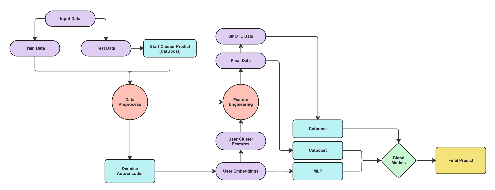

# IT Purple Hack - Alpha Bank 🏦📈🙋🏻‍♂️
## Team: MISIS FOUND HACK
## Модель прогнозирования продуктового кластера клиента



1) В ```knn_and_mlp.ipynb``` в начале нужно запустить ячейки с созданием ```train_ae_v``` и ```test_ae_v```
2) ```python  dae/train.py```
3) Дальше запускать ячейки в ```knn_and_mlp.ipynb```
4) На выходе получаем 
    - ```train_cluster_kmeans12.pqt```
    - ```test_cluster_kmeans12.pqt```
    - ```mlp_submission.csv```
5) Далее подаем получившиеся паркеты в ```vanya.ipynb```
   

------------------------------------------------------------------------------------------------------------------------------------------------------------------------------------------------

1. Известно, что основной характеристикой клиента, влияющей
на его прибыльность, является продуктовый кластер. Возможность предсказать переход клиента в другой продуктовый кластер позволит спрогнозировать его профиль доходности.

2. Мы предсказываем продуктовый кластер клиента на год вперед и делаем это не несколько этапов:
    * Feature Engineering
      - Генерация лагов
      - OneHot кодирование продуктов, которые присутствуют в стартовом продуктовом кластере клиента
      - Обучение нейросетевой модели AutoEncoder на тренировочных данных, получение эмбеддингов клиентов, кластеризация клиентов по этим эмбеддингам (также используем эти эмбеддинги для поиска инсайтов). Далее используем эти кластеры в качестве признаков при прогнозировании таргета
      - Генерация признаков путем агрегирования численных признаков по категориальным
      - Заполнение пропущенных значений (колонки новых клиентов заполняем нулями и при помощи KNNImputer. Пропущенные значения start_cluster в тестовом датасете с датой month_6 заполняем при помощи модели CatBoost)
      - Генерация синтетических данных для редких кластеров (борьба с дисбалансом классов) при помощи SMOTE
    * Обучение моделей
        - Обучение многослойного персептрона на эмбеддингах из автоэнкодера (смю полученных в FeatureEngineering п. с)
        - Обучение моделей Catboost (на различных данных, например с синтетическими данными и без) на стратифицированных по таргету фолдах
        - Обучение моделей Catboost (на различных данных, например с синтетическими данными и без) на части тренировочного датасета и их оценка на валидационной выборке (15% от исходного тренировочного датасета)
    * Ансамблирование
        - Используем технологию блендинга и усредняем прогнозы моделей, полученных в разделе "Обучение моделей", для достижения устойчивого результата и понижения дисперсии

3. Что не помогло из того, что мы протестировали:
    - Прогнозирование продуктов клиента (а не кластеров) и объединение наиболее вероятных продуктов в продуктовый кластер
    - Отдельное предсказывание редких классов
    - Отдельное предсказывание перехода клиента в другой продуктовый кластер (1 - перешел, 0 - не перешел)
    - Использование дополнительных весов
        - На семплы из редких классов
        - На семплы, в которых конечный продуктовый кластер отличается от начального
    - Использование альтернативных моделей (LightGBM, LogRegression...)
    - Подбор гиперпараметров (Optuna)
    - Генерация стастических и геометрических признаков (расстояние от семпла до распределения, расстояние семпла до прямой регрессии...)
    - Стекинг моделей (разбиение трейн датасета на трейн1, трейн2 и валидацию, на трейне1 обучаем все модели, получаем их предсказания на датасете трейн2, обучаем на этих предсказаниях новую более простую модель и оцениваем её на валидации)
